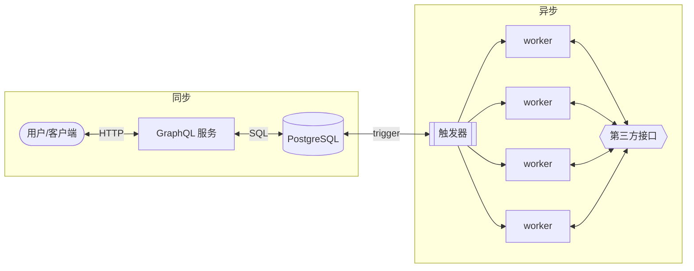
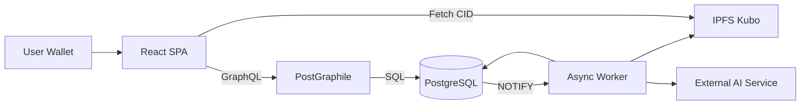

# ChainSight (链视)

> A PostgreSQL-centric, event-driven PoC for decentralized evidence anchoring and semantic propagation analysis.

ChainSight 是一个技术验证原型（PoC），探索将 **内容寻址存储（IPFS）+ 钱包签名 + PostgreSQL 事件驱动架构 + GraphQL API** 结合，用于构建一个透明、可追溯的信息溯源系统。

本项目运行于 **本地 Kubernetes 集群（k0s）**，不依赖真实链上部署即可完成完整演示。

## 1. 架构概览

### 1.1 架构风格




本项目采用：

* **Database-Centric Architecture**
* **GraphQL façade（PostGraphile 自动生成）**
* **Event-driven Worker（LISTEN / NOTIFY）**
* **React SPA（无 SSR）**

数据库是系统的核心边界。


### 1.2 系统结构



## 2. 技术栈

### 前端


* React (Vite)
* TypeScript
* viem（钱包签名）
* tanstack react query & https://the-guild.dev/graphql/codegen（GraphQL 客户端）
* react-force-graph（图谱可视化）
* zustand（状态管理）
* shadcn (UI）

无 SSR。


### 后端

* PostgreSQL 18 (注意，数据库不应该放到 Kubernetes 中，我在开发环境使用 apt 安装了)
* dbmate（数据库迁移管理，不手动维护 migration 版本表）
* PostGraphile 4 （GraphQL 自动生成）
* pgvector（语义检索）
* LISTEN / NOTIFY 事件驱动转发到 worker 当中
* Kubernetes 部署以及开发


### 异步处理

* Worker（Go）

* 监听 PostgreSQL 频道
* 调用：

  * IPFS HTTP API
  * AI 服务
  * 语义分析模块

### 存储

* IPFS (Kubo)
* PostgreSQL

* Append-only Hash Log（模拟“链上不可篡改”）

### 运行环境

* 本地 Kubernetes
* kubectl
* kustomize / 原生 YAML
* Docker images

## 3. 核心设计原则

### 3.1 数据库是系统核心


* 数据模型定义 API 形态
* 权限控制可落在 PostgreSQL
* GraphQL 自动从 schema 派生
* 业务逻辑优先使用 SQL / function

### 3.2 事件驱动而非同步 API 链式调用

证据提交流程：

1. React 调用 GraphQL mutation
2. 数据写入 PostgreSQL
3. Trigger 发出 NOTIFY
4. Worker 异步处理：
   * 上传 IPFS
   * 调用 AI
   * 生成 embedding
   * 建立 semantic edges
5. 状态回写数据库
6. 前端查询更新结果

### 3.3 “不上链但可验证”

PoC 不进行真实链上部署。

替代方案：

* 用户对（CID + timestamp）进行钱包签名
* 数据写入 append-only hash chain 表
* 任意人可验证：

  * 内容未篡改（CID）
  * 记录顺序未篡改（hash chain）
  * 提交者身份（签名校验）

未来版本可替换为真实链上锚定。

## 5. 功能流程


### 5.1 FR-01: 去中心化证据锚定

1. 用户粘贴文本

2. 钱包签名
3. GraphQL mutation 插入 evidence
4. Worker 上传 JSON 至 IPFS
5. 回填 CID
6. 生成 append-only log 记录


### 5.2 FR-02: 自动分析与关联

Worker：

* 调用 AI 分类
* 生成 embedding
* 查找语义相似条目
* 插入 semantic edges

### 5.3 FR-03: 图谱可视化

前端：

* 查询 evidence + edges
* 生成网络图
* 点击节点：

  * 从 IPFS 拉原文
  * 展示 AI 结果

为前端图谱查询预留了数据库函数（可由 PostGraphile 直接暴露）：

* `chainsight.graph_nodes(limit_count)`
* `chainsight.graph_edges(limit_count, min_score)`
* `chainsight.graph_node_detail(node_id)`


### 5.4 FR-04: 用户主权模型

* 无用户名密码
* 所有“写记录”操作都需钱包签名

* 提交者地址存入数据库

* 可独立验证签名

## 6. 本地运行（Kubernetes）

使用新的 gateway api 而不是使用 ingress。

### 6.1 启动集群

```bash
k0s start
kubectl get nodes
```

### 6.2 部署组件


先加载开发环境变量：

```bash
direnv allow
```


一键部署 Phase 1 基础资源（ipfs + postgraphile）：

```bash
make k8s.apply
```

`make` 在启动阶段会先做依赖检查（数据库连通性、kube context 可用性）。若外部服务不可用会直接终止并给出原因。

Kubernetes 资源统一部署在 `chainsight` namespace。

Phase 2 建议先本地运行 worker（避免镜像未发布导致拉取失败）：

```bash
make worker.run
```

运行前请确保已配置 `OPENROUTER_APIKEY`（见 `.envrc.example`），否则 worker 会在启动时快速失败。
若数据库未安装 pgvector，worker 会自动使用 Go 侧 cosine fallback（可用但性能较低）。

可执行 Phase 2 冒烟脚本（需要 worker 正在运行）：

```bash
make phase2.smoke
```


* postgres (apt 安装)
* postgraphile (Deployment)
* ipfs (Deployment + PVC) 单节点即可，不需要复杂的集群
* worker (Deployment)
* frontend (不需要在 Kubernetes 中部署）
* ingress (可选)

## 7. 演示流程（< 5 分钟）


1. 打开首页
2. 连接钱包
3. 粘贴文本
4. 签名
5. 显示“已存证”
6. 切换到详情页
7. 查看：
   * CID
   * AI 标签
   * 相似节点
8. 打开图谱视图
9. 点击节点
10. 验证 IPFS 原文

## 8. 项目目标

本 PoC 旨在验证：

* 内容寻址 + 钱包签名
* PostgreSQL 作为可信中心
* 事件驱动数据流
* GraphQL 自动 API 生成
* 可扩展至真实链上部署


## 9. 设计哲学总结

ChainSight 不是一个传统三层 Web 应用。

它是：

> PostgreSQL as platform
> GraphQL as façade
> Worker as execution layer
> React as visualization shell

数据库定义系统边界。
事件驱动实现异步解耦。
签名与内容寻址保证可验证性。
